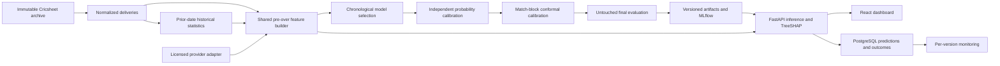

# Crease — cricket next-over forecasting

A real Python ML pipeline and React dashboard for IPL next-over runs, batter contributions, bowler-conceded runs, calibrated event probabilities, and measured prediction intervals. Historical replay is explicitly labeled. No synthetic predictions or fallback forecasts are used.

Read [SPECIFICATION.txt](SPECIFICATION.txt) for the original brief. See [reports/EVALUATION.md](reports/EVALUATION.md) for actual held-out results once training completes, and [MODEL_CARD.md](MODEL_CARD.md) for the supported population and limitations.

## Setup (Windows PowerShell)

```powershell
python -m venv .venv
.\.venv\Scripts\Activate.ps1
python -m pip install -r requirements.txt
python -m pip install --no-deps -e .
crease prepare
python -m pytest -q
crease train --trials 6 --iterations 400
python scripts/render_report.py
```

Raw Cricsheet downloads are immutable and checksummed. Preparation writes normalized delivery Parquet, a player identity map, an exclusion log, over-level features/targets, and an as-of historical store. Re-running preparation from the same archive is deterministic. To acquire a newer snapshot, use a separate data root; do not overwrite archived raw input.

Training requires several minutes or longer depending on hardware. It compares CatBoost, Random Forest, HistGradientBoosting, LightGBM and XGBoost against four baselines. Optuna and ensemble weights use the validation season. The next season is split into probability-calibration and interval-calibration date blocks. The latest complete archive season is used once for final evaluation. Verify archive season completeness before new training runs; the software cannot infer whether an ongoing season is complete.

## Serving

Review the generated report and promote a version that passes the validation baseline gate:

```powershell
crease promote VERSION_FROM_REPORT
$env:CREASE_API_KEY = 'your-long-random-secret'
crease serve
```

The default local database is SQLite. Set `DATABASE_URL` for PostgreSQL. The API listens on `127.0.0.1:8000`; interactive OpenAPI documentation is at `/docs`. Production deployment should terminate TLS and apply request/rate/body limits at the reverse proxy. Model loading occurs once at startup; restart workers after an explicit promotion. Never load untrusted joblib artifacts.

```powershell
cd frontend
npm ci
npm run dev
```

Open the printed local URL. Connect with the API URL and bearer token. The token stays in React memory, not browser storage. Select a historical test over to inspect genuine stored-model inference; use the live-state JSON input for a validated provider state. A private hosted dashboard can show packaged historical replay and evaluation without any local API. Live mode needs a reachable HTTPS Python API with the dashboard origin allowed in CORS; Cloudflare Sites cannot host CatBoost itself.

## API

- `GET /health`: process/model/provider readiness; no authentication.
- `GET /model`: complete active model report.
- `POST /predict/next-over`: validated full innings prefix and nominated players.
- `POST /predictions/{id}/actual`: idempotent actual-result recording; conflicting corrections rejected.
- `GET /monitoring`: per-version recent prediction errors and coverage.
- `GET /replay/states`, `GET /replay/{id}`: held-out historical replay.
- `WS /ws/status`: send bearer token as first message; periodic readiness messages.

Protected endpoints require `Authorization: Bearer …`. Predictions are keyed by model version and canonical state for idempotency. No promoted model returns 503. Contradictory scores, target-over data, stale historical snapshots, shortened/revised innings and unconfirmed bowlers are rejected. The minimal example in the brief needs additional venue, teams, target and complete prior-delivery history to compute production features correctly; these are deliberately required.

## Live provider contract

The chosen integration is provider-neutral. Set `LIVE_PROVIDER_URL` to an HTTPS endpoint returning:

```json
{"observed_at": "2027-04-01T14:00:00Z", "state": {"...": "MatchState fields from /docs"}}
```

Set `LIVE_PROVIDER_TOKEN` if needed. `crease ingest MATCH_ID` fetches a fresh state, validates it and posts to the prediction API. The adapter rejects observations older than 30 seconds, future clocks beyond 5 seconds, unexpected match IDs and invalid schemas. Translate your licensed provider payload into this contract upstream; no commercial feed is silently assumed.

Historical snapshots must precede the requested match date. Refresh from fully completed prior-date matches and atomically replace the history artifact before restarting serving. Corrections require rebuilding from immutable raw snapshots. Do not insert partial live matches into career statistics.

## PostgreSQL and containers

Copy `.env.example` to `.env`, replace the secrets, train/promote a model, then:

```sh
docker compose up --build -d
```

PostgreSQL uses a persistent volume and a health check. API artifacts mount read-only; the service runs as a non-root user. `requirements.txt` records the executed environment. There is no Redis dependency because durable idempotent predictions already avoid redundant model work. Database schema evolution requires reviewed migrations before later releases; initial tables are created on startup.

## Experiments, monitoring and retraining

Each training run writes an immutable timestamped model directory, MLflow run, parameters, dataset hash, report, feature importance, Optuna trial table, and 100 worst predictions. View runs with `mlflow ui --backend-store-uri ./mlruns`. Previous versions remain available; promotion only changes `models/active.json`. No automatic promotion or test-driven tuning occurs.

Retraining is the same `prepare → test → train → report → promote` workflow using a new raw snapshot and newly chosen chronological partitions. After inspecting 2026 test performance, it cannot be treated as untouched for future iterations. Monitor per-version MAE, Brier and interval coverage after posting observed outcomes. Small windows are descriptive, not proof of drift or reliability. The current release has no autonomous retraining scheduler or alert delivery.

## Architecture



## Verification

`python -m pytest -q` checks delivery/extras/wicket accounting, partial-over targets, replacements, identity mapping, chronology, future-data perturbations, conformal rank, input validation, historical/live parity and fail-closed API behavior. `npm run build` and `npx tsc --noEmit` verify the dashboard. Synthetic fixture records exist only in tests and never enter model training or displayed predictions.

The implementation is a measured first release, not a certification of production readiness. Deployment load/security testing, provider-specific integration, database migrations/backups, verified player-role metadata, and sequential-model experiments require further work; see the model card for precise boundaries.
